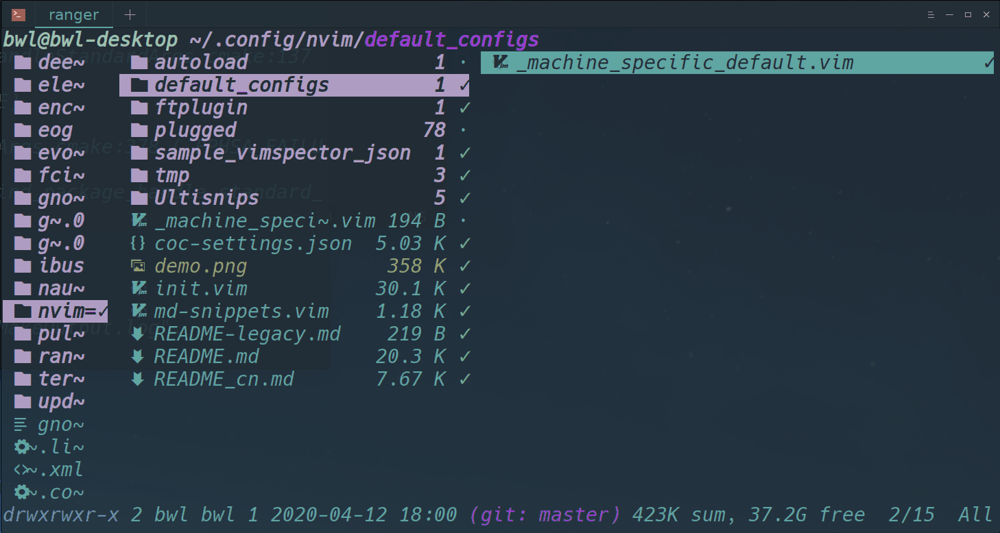

# 网口
关于墙内部的网口插座，我以为多半是为了穿透墙壁，所以在墙的一侧有网口插座则在另一侧一定有网的输入插座。而这叫相互应。

# EFI
- 使用EFI将，目录进行统一，这里我们只需要将每个系统的**具体引导目录** 保留下来，而作为一开始就需要读进内存的**BOOT文件夹** 则应该保存**Clover的BOOT文件夹** 
- 这样就可以实现使用一个磁盘的EFI分区，完成多个系统的引导。
- *需要注意一点：对于无法查看Linux->Entries可以考虑在**Clover中是否勾选上了Linux***  

# pip
- 在我下载并使用ranger的时候，对于不能preview的images需要采取的是`pip3 install ueberzug`
- 而对于里面有很多依赖包会在pip一开始就会下载，而对于编译时候需要的运行环境，则不一定会进行下载，在这种情况下，根据出错位置的代码百度查找。可以有效的定位因缺少运行环境而导致的不能编译的问题。
- 事实上，ueberzug就是这么解决的
> ### 效果图：
>  

🥶
